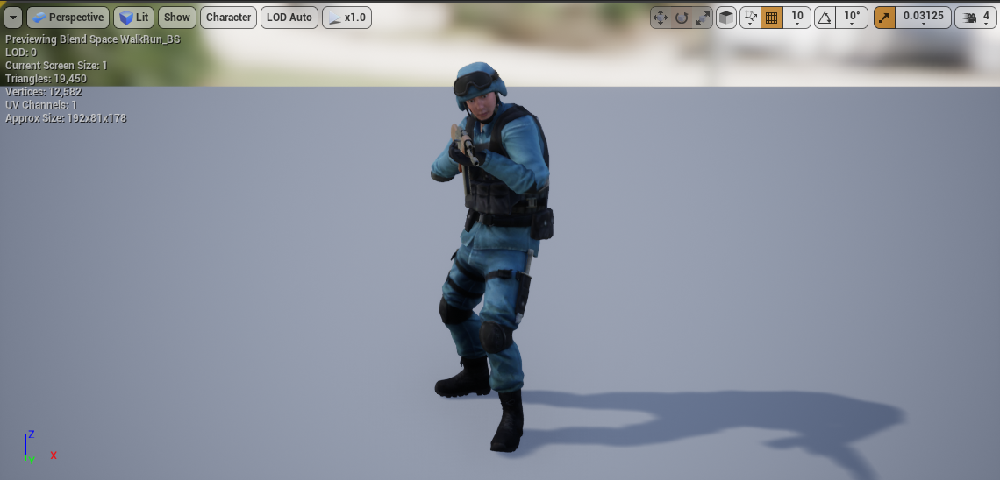

# Zombie-Slayer

Game Description: a First-Person Shooter game which you can use your weapons (AK47 or M4A1) to shoot and kill zombies ambushed in the woods. This game is a personal project and is based on the Unreal Engine 4.26

## Requirement

[Unreal Engine 4.26](https://www.unrealengine.com/en-US/)

## Game logic and functionality

* Game interface
  * **Player's HP and Armor**: on the bottem left corner
  * **The minimap (radar)**: on the top left corner to let you get information about your current location and zombies' location
  * The **message panel**: at the bottem of the minimap, which shows status of your current object (e.g. Kill all zombies)
  * The **Timer**: on top of the minimap (radar)
  * A **gun (AK-47)**: is always your first equipped gun, and the icon is shown on the bottem right corner
  * **Ammo Count**: on bottem right corner
  * A **shooting sight** is always in the center of the screen
  </img>
  
  * Player models
  * There are two types of player **models**:
    * **Policeman**: a **SWAT** model
    * **Zombie**: a mutant policeman-like zombie
    * </img> </img>

  * **Animations**:
    * **Walk** towards four different directions
    * **Sprint** towards four different directions
    * **Jump** without affecting upper part body
    * **Shoot** without affecting lower part body
      * This makes the player walk or run more naturally. It uses interpolation function to map different combinations of user input to different animations.
      * </img>
      * </img>
      * </img>
      * </img>
      * </img>
      * </img>

  * **State Machine**
    * There are multiple layers in the player state machine.
    * </img>
    * </img>

* Gun model
  * **AK47** and **M4A1**
  * **Shooting animation are added**
  * </img> </img>
    
## References
* [Unreal Engine AI with Behavior Trees | Unreal Engine](https://www.youtube.com/watch?v=iY1jnFvHgbE)
* [Game Development in C++ and Unreal Engine (Stanford CS193U)](https://www.tomlooman.com/stanford-cs193u/)
* [Learn Unreal Engine (with C++) - Full Course for Beginners](https://www.youtube.com/watch?v=LsNW4FPHuZE)
* [Blueprints vs. C++: How They Fit Together and Why You Should Use Both](https://www.youtube.com/watch?v=VMZftEVDuCE)
* [Creating A First Person Shooter Game (FPS) With Unreal Engine 4](https://www.youtube.com/watch?v=DywBqQtTHMo&list=PLL0cLF8gjBprG6487lxqSq-aEo6ZXLDLg)
* [Unreal Engine Beginner Tutorial: Building Your First Game](https://www.youtube.com/watch?v=QJpfLkEsoek)

## License

[MIT License](https://github.com/Armour/Multiplayer-FPS/blob/master/LICENSE)
